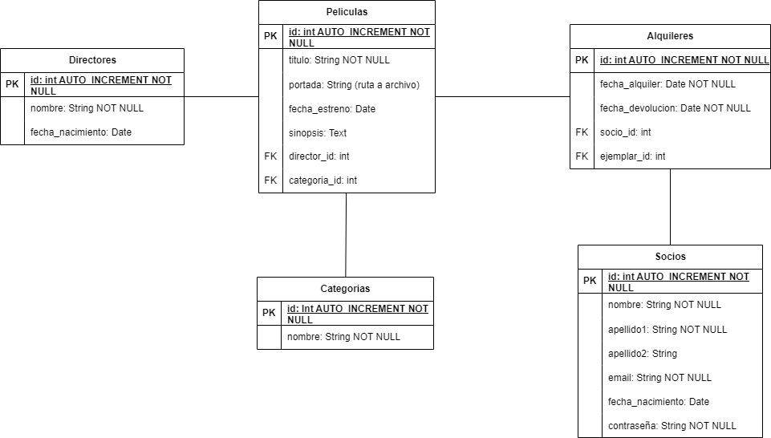

# PROYECTO PELICULAS
## Ismael Ramos Rodríguez

### 1. Base de datos



### 2. Instalar dependencias
```
npm install
```
```
composer install
```


### 3. Ejecutar servidor
```
wsl
```
```
sail up -d
```

### 4. Ejecutar migraciones
```
sail artisan migrate:fresh --seed
```
### 5. Ejecutar estilos y scripts
```
npm run dev
```

### 6. Credenciales de acceso
Puede registrarse un usuario nuevo o acceder con las siguientes credenciales:
```
email: ismael@gmail.com
password: castelar
```
